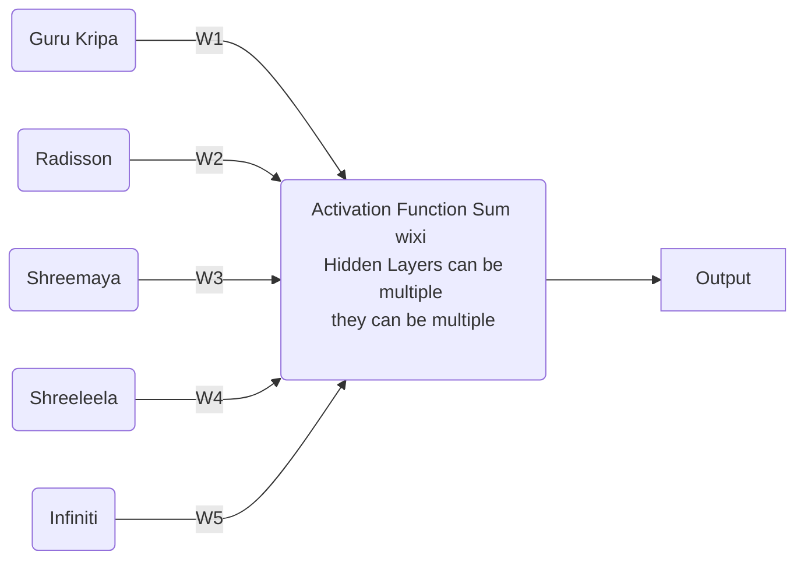
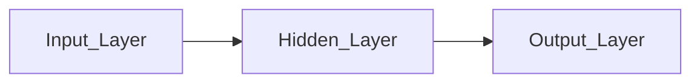

# Piyush Joshi’s Deep Learning DS5B-605

# Syllabus

**By Puneet Gupta**

***Credits 3 (L(2)-T(0)-P(2))***

Lecture Time - Sunday 10AM - 12PM

**OBJECTIVE:**

This course aims to present the **mathematical, statistical and computational** challenges of building stable representations for **high-dimensional data**, such as **images, text and data**. We will delve into selected topics of Deep Learning, discussing recent models from both supervised and unsupervised learning. Special emphasis will be on c**onvolutional architectures, invariance learning, unsupervised learning and non-convex optimization.**

<aside>
💡 There will be 2 tests and assignments. Assignment do yourself, good assignment good marks. The more effort you make the better you will score. Ask doubts and stay active here

</aside>

**COURSE DESCRIPTION:**

**Unit-I (This unit will be time taking around 10-14 hrs, 2 practical ANN)**

- Introduction of Deep learning
- Neural Network
    - Feed Forward Neural Network,
    - Back Forward Neural Network
- The Backpropagation algorithm
- Activation Function
    - Threshold
    - Sigmoid
    - Rectifier(ReLU)
    - Hyperbolic Tangent (tanh)
    - Gradient Descent
    - Stochastic Gradient Descent
    - Cost Function
    - Global minima and Local minima.

**Unit-II (only 2-2 lectures, dependent on first unit, only one practical of CNN maybe)**

- Convolutional Neural Networks
- Introduction of Keras
- Convolutional Neural Networks vs Human Brain
- Convolution Operation
- ReLU Layer
- Max Pooling Layer
- Data Flattening
- Fully Connected Layer
- Softmax & Cross-Entropy
- Data Augmentation
- Create image Dataset using Data Augmentation and Create CNN Model with Keras.

**Unit-III:** 

- Recurrent Neural Networks
- Uses of Recurrent Neural Networks
- Its application
- Issues with Feed Forward Network in RNN
- Backpropagation and Loss calculation
- Vanishing Gradient
- LSTM: Memory cell
- Forget gate
- Input gate
- Output gate
- Implement of RNN model in NLP with Keras.

**Unit-IV (This will be time taking and also has Practical part, only one practical of RNN maybe)**

- Boltzmann Machine
    - Energy-Based Models (EBM)
    - Restricted Boltzmann Machine
    - Contrastive Divergence
    - Deep Belief Networks
    - Deep Boltzmann Machines
- Self-Organizing Maps
    - Introduction Self-Organizing Maps
    - K-Means Clustering
    - Auto Encoders
    - Applications of Dynamic Memory Networks in NLP
    - Recent Research in NLP using Deep Learning
        - Fake news classifier
        - Similar question detection
        - Dialogue topic tracking.

**TEXTBOOKS**

Bengio, Yoshua, Ian J. Goodfellow, and Aaron Courville. "Deep learning."  MIT Press, (2015).

Bengio, Yoshua. "Learning deep architectures for AI." Foundations and trends in Machine Learning 2.1 (2009): 1127.

Hochreiter, Sepp, and Jargen Schmidhuber. "Long short-term memory." Neural computation 9.8 (1997): 17351780.

**Course Outcomes:**

After completing the study of the course the students are expected to:

- understand complexity of Deep Learning algorithms and their limitations;
- understand modern notions in data analysis oriented computing;
- be capable of confidently applying common Deep Learning algorithms in practice and implementing their own;
- be capable of performing distributed computations;
- be capable of performing experiments in Deep Learning using real-world data.

# Lecture DL-2022-08-28

- Deep Learning will be confusing topic requires concentration
- Why do we need Deep Learning?
    - When we have lots of data
    - In Machine Learning we have to do the feature engineering while in Deep Learning it does that by itself
    - When we have to derive something from image and text or work like human brain
    - Preserving meaning of text
- Its main objective is
    - Model should automatically understand which feature is important
    - Data we are giving more and more everyday (0.5 Billion → 1 Billion → 10 Billion → 100 Billion) but its performance was not increasing in Machine Learning, prediction and accuracy was not increasing, performance does not improve with data
    - Deep Learning is a combination of Statistics, Algebra, Calculus, Programming.
    - WIll give numerical on ANN to understand how its working?
    - In Deep Learning as the data size improves, the performance also improves

- What is a Neural Network?-
- What is Neuron?
    - Basic unit of Human Brain
    - They continuously activate and deactivate
    - It hurts when we touch hot glass, information goes from neuron to brain.
- Neural Network has a hidden layer, input layer, output layer
- Deep Learning understanding requires Machine Learning which is subset of AI
    - It is a combination of statistics and computation

***Difference between R2 and Adjusted R2?***

No Global and Local Minima and Gradient Descent stuff taught till now (it will be there as its both in Deep Learning and Machine Learning?

Issue in Machine Learning, automatic assignment of features is there in Deep Learning

We have given the input and then it decides, which features are to be selected and which are to be removed. 

It can activate and deactivate any feature, automatic feature extraction and management is done, weightage is assigned to every connection

For e.g. you have features like

Age, Height, Weight, Gender, Income and you have to predict weight, what will be the feature selection?

Height, Age, Gender will be the feature, Gender will also have less role to play too

Automatic weight will be assigned by Neural Network, it will relate everything automatically, it can even put weight 0 too, automatic handling is there

In Machine Learning, you have to tell everything yourself, which feature to keep and remove

In Deep Learning like Human Brain, if lion comes you run

but in Machine Learning we keep on checkiing what is the animal and then decide whether to run or not

We will mostly work on Google Colab and with tools like Keras and Tensorflow

If you wanna do more practicals, you will have to the theory by yourself. 

Theory is also complicated which needs to be understood a lot

For getting a job the red ones are really crucical

Practicals can be done by assigning my projects to you.

Recently, you guys must have the retail project, it was to check the knowledge, there was a requirement in my team. 

Vandit Sir sent it, it had some loophole, it was my project where are you going, requirement in my team, thing has been put on hold. 

Also make PPT, one was from MSc other from Mtech

You can also get these real life projects from me, direct industrial projects will be given to you on the contrary side

Libraries we will mostly use Keras and Tensorflow not Pytorch.

Industry mostly requires only these.

To do more practicals you have to counter the theory yourself, mot probably that you will have in understanding is around BackPropagation Algorithm numericals, which will take 2-4 hours. Optimizer will have like Stochastic optimizer, Adam, RMSE different different optimizer, if you keep on defining the equation it will take a lot of time. Everything will be presented in easy way, but you will have to cover the theory on yourself

CNN and RNN won’t take much time. Apart from it I will also give you some real life projects if I will get time for that. Recommendation System needs to be 

Timings will 10-12 Deep Learning and 2-4 Data Visualization

A lot of patience will be needed in this, else things will bounce off 

# Lecture DL-2022-09-04

- Main reason why deep learning came into existence was the fact that over time the machine learning models failed to improve their accuracy with the increasing data, performance was plateauing, which attribute are important and not which to keep which to ignore became an issue, automatic decision what to keep and what not to
- Started in 1991, implemented by 2002 and scale implementation in 2003. The way human brain thinks the machine thinks the same way
- What you do when a lion comes from front? You run. The input point within the body are total 5 - eyes, ear, nose, skin, tongue
- Number of Neurons in human body

- Every information within the body that is passed between neurons is assigned some weightage, lion vs tiger weightage, eyes will give more weightage to lion

- You take response of dropping the glass which hurts the body like 50-60 degree water vs 2-3 degree water

- Weight is assigned between 0-1 and is assigned in the synapse analogous part

- Why weights are assinged? Which inputs are necessary and which are not
- Weight helps in this kind of decision, it helps determine which input is how much important
- You give more importance to lion than cat, a dummy lion is given same importance as actual later you will reduce its weight once you find that out
- SUppose you wanna order food 5000/5 good quality and budget
- You are given names of 5 restaurants for that

- These hidden layer diminsh the importance of features, unnecssary features are removed by hidden layers, as various activation function exist there
- More the number of hidden layer, more accurate the model will be

Feed Forward Network

- ANN (Artificial Neural Network) is used for both regression (continuous data) prediction and classification like in decision tree, supervised learning stuff
- CNN (Convolutional Neural Network) is used mainly for images
- RNN (Recurrent Neural Network) is used for time series, text data or NLP data, important for historical outputs

- Linear Regression is linear activation function

- Softmax Activation function is used in case of multiple classification
- Sigmoid is used in case of normal classifcation
- Leaky Relu and relu both are same leaky chinese scientist modified it upto some extent
- tanh range is -1 to +1, it is used in RNN a lot

- If the value of node become 0 it is deactivated it is not forwarded from there on, its information is closed

- What is the formula of logistic regression?
    - Its types, its formulas

Your HW is what is the formula of logistic regression and derive it, value is between 0 and 1

its mid point is 0.5 

- Drawback was that even if its value was -3 came it deactivated it

Leaky Relu said that define the negative as small linear component of x

Can you explain it with some example?

Take small componenet of negative output node, this prevents its deactivation

Converts to probabilities

- the reason is not about converting the negative to positive but rather conversion of probabilities using exponential

- Normalization of probabilities obtained is done using exponential function
- 

# Lecture DL-2022-09-10

- Here its a Feed Forward Netowrk, there is no backward, no output is reversed, unlearn or update is not there

# Lecture DL-2022-09-11

This link will be relevant from the perspective of the article [https://stats.stackexchange.com/questions/154879/a-list-of-cost-functions-used-in-neural-networks-alongside-applications](https://stats.stackexchange.com/questions/154879/a-list-of-cost-functions-used-in-neural-networks-alongside-applications)

- When the neural network goes forward its feed forward when it goes back its back propagation

There can be many neurons in the hidden layer, in the above problem we have to predict house price

- In continous regression case there will be one output, in binary classification there will be 2 in multi-class classification there will be multiple

Gradient Descent or Loss Function needs to be minimum, and global minima of it is found

There are three ways to input data in model (or optimizer)

- Gradient Descent - entire data is input at once, time and compute consuming
- Stochastic Gradient - Rows one by one, accuracy will be good but time will be a lot
- Mini Batch - We do sampling here of say 1000 out of 10000
- Ada
- Adam
- RMS Prop

The way we use the optimizer the backpropagation will work that way

Numerical of Optimizer are very lengthy

Calculate the value of W1*

Practice the equation at home 

Numerical is available online search for it

Momentum

Adam Optimizer is one many army it can do everything

# Lecture DL-2022-09-18

Why interpretability of Machine Learning is more than Deep Learning though Deep Learning can be more accurate? In ML we create features manually, in Deep Learning feature creations is automatic, its done in hidden layer, automated training is there in Deep Learning

- When we will do practical you will learn it much better
- In ML we import data, train test
- In DL data handling is more complex here relative to Machine Learning

Why we were using Backpropagation?

- To update the weight and reduce the error

Its equation is same is linear equation

What is Local Minima and Global Minima?

- Global Minima is the point at which the error term is minimum

- Gradient Descent is used to find global minima, goes back and minimizes the error. Does till it doesn’t find global minima

- As soon as the error starts increasing that point becomes minima

What Brute Force does? It doesn’t apply shortcut, it applies all possibilities, if your slope is negative, your weight adjustment is large, but as the slope tends to zero, weight adjustment is reduced to the levels so that we don’t miss the global minima.

 

- Gradient Descent inputs all data at onces. Issues
    - time consuming
    - if dataset is small the time is low
    - as the size is increased time is increased
- When we input all data at once, weight adjustment and loading both take a lot of time
- In ML Model training is fast, but its testing is slow, as we select features, while in DL training takes time but testing is fast
- The interpretation is fast, in DL it finds the exact point of minimum error, in Machine Learning have you studied bias and variance
- Model training is good if bias and variance is low
- Learning rate handling with time

- we input one one iteration at once, not the whole data, and its done randomly
- Whenever the learning rate and bias are minimum, here we get noise more
- In putting whole dataset we input
- Through momentum we handle noise in gradient descent
- Stochastic is also time taking a lot

- Stochastic follows Convex Loss Function
- Global Minima is the lowest of all
- All other Minima are local minima

- This is used in case of blackouts

- In ANN the outputs were independent and not dependent on previous output
- In case of time series, the prediction is done on basis of historical data, hence the need to store became necessity.
- E.g. Whatsapp keyword are dependents on previous words, for some little time the previous memeory is stored

MSc is a non-technical degree, do practicals that increase the weightage of your resume, else technical guys will consume your job. Think of it like you are preparing for an exam

Participate in Hackathon for new ideas, for internal employees

one thing that is going on is cricket league, hackathon ideas that would be beneficial, product based, business based documentation, presentation, selection, you will be given 15 days to show PoC, (more like demo presentation), this happens in product based companies, business learning as well as job security is higher in big product based companies. Service base companies are prone to recession and less job security is also there. Product base companies you learn business, in service based companies you learn multiple things only limited. 

Our team was smallest, one developer, one devops who handles cloud, one business, one product, in other there were multiple.

There were total 123 ideas, our team is in top 5 ideas, PoC deadline in 15 days with demo

International trip prize + cricket match both

Multitasking with sports makes you enjoy things in life

Learning is higher by meeting business folks

Supervised and Unsupervised Learning both used…. Reinforcement Learning

How real life problem is faced, Hackathons help you better understand problems and business?

Create a resume such that resume gets shortlisted, add only those things which you can easily explain, not just basics

Interviewer often stops you at point where you are gonna get stuck and you are screwed

Real life problem needs to be solved computationally

Why you chose randome forest, why not something else? Theory concept clarity is really importnat

If you can answer why, how you have implemented it wont be asked…

150 interviews given till now, i still apply in companies

Test yourself time to time, more important is learning

# Lecture DL-2022-09-24

## Practical 1 - Classification ANN Problem

Keras Docs  - [https://keras.io](https://keras.io/)

Google Colab File - [https://colab.research.google.com/drive/17xVRNh-VVBW7K3zkPgSXJ_b5DtUAueRd?usp=sharing](https://colab.research.google.com/drive/17xVRNh-VVBW7K3zkPgSXJ_b5DtUAueRd?usp=sharing)

Dataset File - [https://drive.google.com/open?id=1JQ8bD8-lY4Zcm7Dtetxt9vbCmBy0baJ2&authuser=sdsf.mscdsa%40gmail.com&usp=drive_fs](https://drive.google.com/open?id=1JQ8bD8-lY4Zcm7Dtetxt9vbCmBy0baJ2&authuser=sdsf.mscdsa%40gmail.com&usp=drive_fs)

- We use sigmoid because it gives binary output
- Relu is used for linearalization

<aside>
💡 Keras is API and tensorflow is Library

</aside>

Epochs is step or iteration

What is the combination of input layer and hidden layer best?

This was a classification problem

Now we will take a look at a regression one

## Practical 2 - Regression ANN Problem

# Lecture DL-2022-09-24-Part2

Predicted - Actual value is Bias

Variance is a average difference of lines from which prediction is done that is variance

in an overfitted situation if we bring an external point the variance increases suddenly

optimizers are also called hyperparameter tuning in machine learning

# Lecture DL-2022-10-2022

[https://en.wikipedia.org/wiki/MNIST_database](https://en.wikipedia.org/wiki/MNIST_database)

[http://yann.lecun.com/exdb/mnist/](http://yann.lecun.com/exdb/mnist/)

[http://colah.github.io/posts/2014-10-Visualizing-MNIST](http://colah.github.io/posts/2014-10-Visualizing-MNIST)

# Lecture DL-2022-10-02

## CNN Practical 1 - Cat and Dogs Dataset

Ipynb File for CNN Practical - [https://drive.google.com/file/d/1YhI7lXhWCwxkEFwlS-g9AlaXDDEi9V-p/view?usp=sharing](https://drive.google.com/file/d/1YhI7lXhWCwxkEFwlS-g9AlaXDDEi9V-p/view?usp=sharing)

Dog Cat Dataset - [https://drive.google.com/drive/folders/1-zRlfgemyQOTjB97ERvuaNyuv49Tjrh4?usp=sharing](https://drive.google.com/drive/folders/1-zRlfgemyQOTjB97ERvuaNyuv49Tjrh4?usp=sharing)

## CNN Practical - 2 (Image Import CV)

**SQL Practice**

If Puneet Sir asks for resume or anything, he will take the first round. Practice for Analyst

- SQL - Window and Case Len (kind of if else)
- Python
- Power BI and Tableau

For Data Science

- ML/DL
- Kaggle
- A on Substack

# Lecture DL-2022-10-16

Good Article - [https://machinelearningmastery.com/exploding-gradients-in-neural-networks/](https://machinelearningmastery.com/exploding-gradients-in-neural-networks/)

# Lecture DL-2022-10-29

[https://colah.github.io/posts/2015-08-Understanding-LSTMs/](https://colah.github.io/posts/2015-08-Understanding-LSTMs/)

## Practical 1 SMS Spam.csv

Link to Jupyter Notebook

[https://drive.google.com/open?id=1MfZLNaPIEZnWS7PtgDe6j0RgRQumxmbT&authuser=sdsf.mscdsa%40gmail.com&usp=drive_fs](https://drive.google.com/open?id=1MfZLNaPIEZnWS7PtgDe6j0RgRQumxmbT&authuser=sdsf.mscdsa%40gmail.com&usp=drive_fs)

Link to Dataset

[https://drive.google.com/open?id=1MeC_lnxuY1LvwXXAsJD3qlnQv3lfp2pO&authuser=sdsf.mscdsa%40gmail.com&usp=drive_fs](https://drive.google.com/open?id=1MeC_lnxuY1LvwXXAsJD3qlnQv3lfp2pO&authuser=sdsf.mscdsa%40gmail.com&usp=drive_fs)

tf.keras.preprocessing.sequence.pad_sequences

# Lecture-DL-2022-11-13

[https://grouplens.org/datasets/movielens/](https://grouplens.org/datasets/movielens/)

[https://www.sciencedirect.com/science/article/pii/S2405471220304567](https://www.sciencedirect.com/science/article/pii/S2405471220304567)

## Practical DL-2022-11-13-Stack_AutoEncoder_RecommendationSystem

[https://www.kaggle.com/datasets/prajitdatta/movielens-100k-dataset](https://www.kaggle.com/datasets/prajitdatta/movielens-100k-dataset)

[https://colab.research.google.com/drive/1lK-s9WkXdwrfql3Q0b7R3tYVqg__BQ_M#scrollTo=5waQFGCsuKmD](https://colab.research.google.com/drive/1lK-s9WkXdwrfql3Q0b7R3tYVqg__BQ_M#scrollTo=5waQFGCsuKmD)

